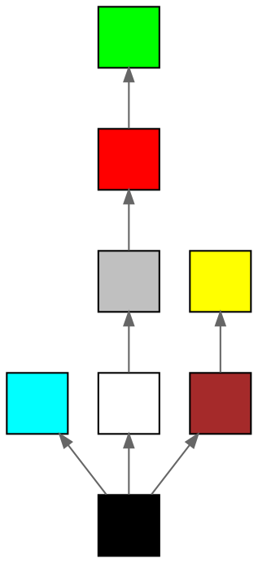

First Example

```graphviz
digraph BottomUpTree {
    // Set graph direction to bottom-up
    rankdir=BT;
    node [shape=square, style="filled", fontname="Arial", label = ""];
    edge [arrowsize=0.8, color="#666666"];

    // Nodes (leaves at the top, root at the bottom)
    Black [fillcolor="black"];
    Green [ fillcolor="green"];
    Brown [fillcolor="brown"];
    Gray [ fillcolor="gray"];
    Yellow [fillcolor="yellow"];
    White [ fillcolor="white"];
    Red [fillcolor = "red"];
    Cyan[fillcolor = "cyan"]
    
    Black -> { Cyan White Brown};
    White -> Gray;
    Brown -> Yellow;
    Gray -> Red;
    Red -> Green;
    
    { rank=same; Cyan -> White -> Brown [style=invis] }


    

}
```
