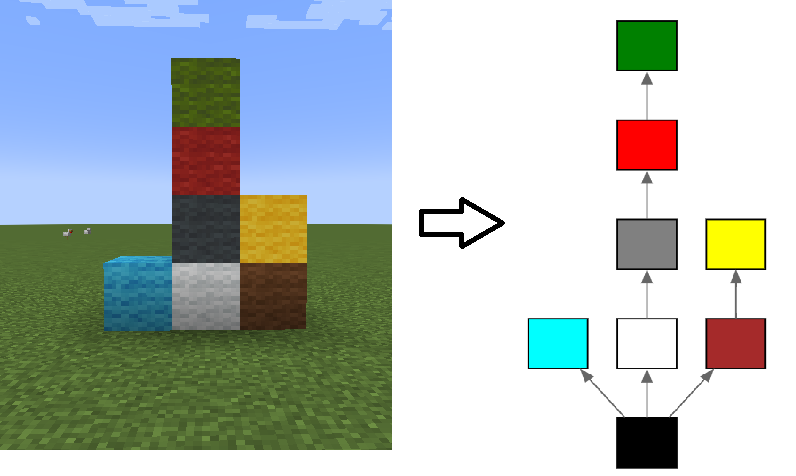

## Data Structure

In order to efficiently check what blocks are left floating after a block are broken, we maintain a directed tree $T$ - rooted at bedrock, where:
* *If there is an Edge A->B, there exists at least once path to bedrock that starts with B->A.*


Note that **the opposite is not true**. That is, if there is no edge $A\rightarrow B$, that does not imply there is no path $B \rightarrow A$ to bedrock. 
- Additionally, we have a map from `BlockPos` to the pos' node on the tree, for fast access. 


## Deletion
Let $V$ be the deleted block. We assume that prior to deletion no block is floating (TODO define floating)


- Let $D_i$ be the set of blocks connected to $V$.   
- Only $D_i$ are potentially floating.  (TODO PROVE)
- Every **Direct** neighbor $V_i$ of $V$ creates a connected component $C_i$ . (TODO PROVE)
 ![[Pasted image 20250203000311.png]]
- All elements of $C_i$  are floating iff $V_i$ is floating. (TODO PROVE)
- Therefore, the set of floating blocks is decided solely on whether $V_i$ are floating. (conclusion)
- In order to avoid a full BFS on every deletion, we will take advantage of existing connections in our tree. 
	- Let $T' = T  -  C(V)$ where $C(V)$ are the children of $V$ and $V$ itself. 
	- $V_i$ is floating in  iff $V_i$ is not in $T'$ and cannot be added to it. (TODO PROVE).  
	![[Pasted image 20250203000410.png]]
Therefore, we will check if $V_i$ is in $T'$. If it is, then it is not floating.
Otherwise, we attempt to add $V_i$ to $T'$. 
	Run a $Down-DFS$ from $V_i$ to find a path to a position in $T'$. (TODO Explain what a Down-DFS is).  
-  If there is a path $P$ from $V_i$ that ends at node $F$ in $T'$, then $\bar P$ (reversed) may be added as a child of $F$. $C_i$ are safe. (TODO PROVE). 
![[Pasted image 20250203001909.png]]
- If there is no such path, then $V_i$ cannot be added to $T'$ (and therefore $C_i$ is floating).  (TODO PROVE). We mark all elements of $C_i$ as floating and remove them from $T$. 
  ![[Pasted image 20250203000740.png]]


Complete algorithm
```
Remove V from T.
Let O be the orphaned descendants of V in T. 
For each neighbor Vi of V:
	If Vi is in T and is not a child of T, skip to the next neighbor.
	Else:
		Find a path using Down-DFS from Vi to an element of T that is not in O. 
		If no path is found:
			Get the connected component Ci of Vi. 
			Remove Ci from T. 
			Add Ci to the list of floating blocks.
		If a path P is found, ending at F which is a node in T:
			In T, attach the reverse of P to F
	
```

(I need an instant-access tree data structure)

# TODO explain why can't use dominator trees and connected sets shenanigens (infinite graph)
